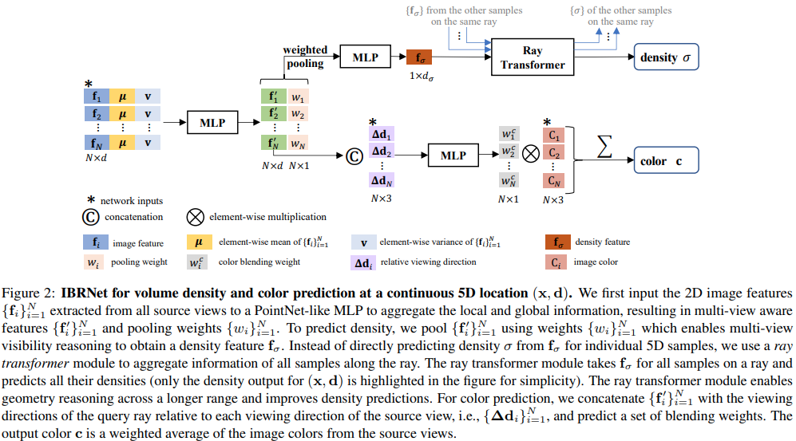

</img>

## IBR-net (wip)

Implementation of <a href="https://arxiv.org/abs/2102.13090">IBRNet, Learning Multi-View Image-Based Rendering</a>, in Pytorch. They combined NERF and attention (Ray transformer) for 3d scene representation, and pushed the network to be able to generalize to novel scenes.

## Citations

```bibtex
@article{wang2021ibrnet,
    author    = {Wang, Qianqian and Wang, Zhicheng and Genova, Kyle and Srinivasan, Pratul and Zhou, Howard  and Barron, Jonathan T. and Martin-Brualla, Ricardo and Snavely, Noah and Funkhouser, Thomas},
    title     = {IBRNet: Learning Multi-View Image-Based Rendering},
    journal   = {arXiv preprint arXiv:2102.13090},
    year      = {2021},
}
```
